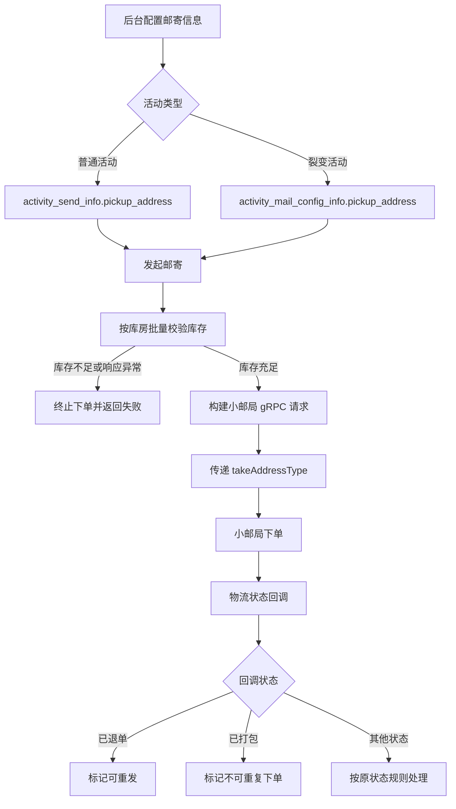

# 取件地址类型与邮寄状态兼容需求

## 1. 文档信息

| 项目   | 内容                     |
| ---- | ---------------------- |
| 项目   | fundx-equity-center    |
| 分支   | `feature-mail-address` |
| 对比基线 | `prod`                 |
| 文档状态 | 待评审                    |
| 编写日期 | 2026-08-06             |

## 2. 背景

权益中心现有邮寄流程只保存寄件人的文本地址，库存校验和小邮局下单无法明确区分实际取件库房。当同一权益物分布在不同库房时，可能出现库存校验口径与实际发货库房不一致的问题。

同时，小邮局新增“已退单”和“已打包”物流状态，权益中心需要正确接收、展示并参与后续重发判断。

## 3. 需求目标

1. 活动配置邮寄信息时，必须选择取件地址类型。
2. 普通活动和裂变活动均需持久化取件地址类型。
3. 库存校验必须按取件地址类型检查对应库房库存。
4. 小邮局下单时必须携带取件地址类型。
5. 权益中心需要兼容小邮局“已退单”和“已打包”状态。
6. 已退单订单允许重新下单，并生成新的业务订单号。

## 4. 需求范围

### 4.1 本期范围

- 普通活动邮寄配置。
- 裂变活动邮寄配置。
- 单商品和多商品库存校验。
- 小邮局普通下单和 V2 下单。
- 普通活动、裂变活动和股票业务的物流状态回调。
- 已退单订单的重发处理。

### 4.2 非本期范围

- 库房基础数据后台维护。
- 动态增删库房类型。
- 库房库存调拨。
- 历史物流状态重新计算。

## 5. 取件地址类型

| 编码 | 名称 | 后台是否展示 |
| --- | --- | --- |
| 1 | 自管库房 | 是 |
| 2 | 北京京东库房 | 否 |
| 3 | 顺丰库房 | 是 |
| 4 | 雪球库房-北京融新 | 是 |
| 5 | 云仓库房 | 是 |

后台通过 `GET /mail_order/get_pickup_address_type` 获取可选项。取件地址类型为必填项，非法编码应直接拒绝保存。

## 6. 核心业务流程



## 7. 功能需求

### 7.1 取件地址选项查询

- 后台进入邮寄配置页面时查询取件地址类型列表。
- 接口只返回当前允许使用的库房。
- 返回字段包含 `code` 和 `desc`。
- 当前不展示编码为 2 的北京京东库房。

### 7.2 普通活动邮寄配置

- 新增或编辑寄件人信息时必须提交 `pickup_address_type`。
- 系统校验编码是否属于取件地址枚举。
- 保存至 `fundx_equitycenter.activity_send_info.pickup_address`。
- 查询活动寄送信息时返回 `pickup_address_type`。

### 7.3 裂变活动邮寄配置

- 新增或编辑裂变邮寄配置时必须提交 `pickup_address_type`。
- 保存至 `fundx_equitycenter.activity_mail_config_info.pickup_address`。
- 查询裂变邮寄配置详情时返回 `pickup_address_type`。
- 邮寄订单生成时，从当前活动邮寄配置读取取件地址类型。

### 7.4 库存校验

- 库存校验统一调用批量库存接口：`portal/api/goods/batchCheckInventory`。
- 请求必须包含预算 BU、预算单元、快递类型、取件地址类型和商品明细。
- 多收件人存在相同 SKU 时，应先按 SKU 汇总数量后再请求库存接口。
- 任一 SKU 库存不足，整批订单不得继续下单。
- 库存接口返回为空、失败或明细不完整时，应按库存校验失败处理。

批量库存请求示例：

```json
{
  "unitNo": "预算单元编码",
  "bu": "预算BU",
  "delivery": "快递类型",
  "pickUp": 3,
  "detailedData": [
    {
      "goodsCode": "SKU编码",
      "quantity": 10
    }
  ]
}
```

### 7.5 小邮局下单

- 普通下单和 V2 下单均需向小邮局传递 `takeAddressType`。
- `takeAddressType` 必须与库存校验使用的取件地址类型一致。
- 下单前应保证取件地址类型非空且合法。
- 历史活动缺少取件地址类型时，不得因空指针导致任务异常；应采用评审确认的默认库房或阻断并给出明确错误。

### 7.6 物流状态兼容

| 小邮局状态 | 小邮局编码 | 权益中心状态 | 权益中心编码 | 处理规则 |
| --- | --- | --- | --- | --- |
| 已取消 | 10 | 已取消 | 11 | 允许重新下单 |
| 已退单 | 11 | 已退单 | 12 | 允许重新下单，展示失败原因 |
| 已打包 | 12 | 已打包 | 13 | 不允许重复下单 |

已退单订单重新下单时：

- 普通活动重新生成订单号，避免复用原订单号。
- 裂变活动进入定时重试范围，受最大重试次数和分布式锁控制。
- 新订单与原退单记录的关联和审计方式需保留现有订单日志能力。

## 8. 数据变更

### 8.1 普通活动寄送信息

表：`fundx_equitycenter.activity_send_info`

新增或启用字段：

```sql
pickup_address INT COMMENT '取件地址类型'
```

### 8.2 裂变活动邮寄配置

表：`fundx_equitycenter.activity_mail_config_info`

新增或启用字段：

```sql
pickup_address TINYINT COMMENT '取件地址类型'
```

### 8.3 历史数据

- 上线前统计两张表中 `pickup_address IS NULL` 的有效配置数量。
- 明确历史配置的默认库房并执行数据回填；若不能回填，业务代码必须显式阻断并返回可识别错误。
- 数据库字段应先于应用发布，避免 Mapper 查询新字段时报列不存在。

## 9. 接口变更

| 接口或调用 | 变更 |
| --- | --- |
| `GET /mail_order/get_pickup_address_type` | 新增，返回取件地址类型列表 |
| 普通活动寄件人配置 | 新增必填字段 `pickup_address_type` |
| 裂变活动寄件人配置 | 新增必填字段 `pickup_address_type` |
| 批量库存 HTTP 接口 | 新增 `pickUp` 和 `detailedData` 请求结构 |
| 小邮局 gRPC 下单 | 新增 `takeAddressType` |
| 物流回调 | 新增小邮局状态 11、12 的映射 |

## 10. 兼容与异常处理

1. 新建配置缺少取件地址类型时，返回参数错误，不写入数据库。
2. 取件地址编码不合法时，返回明确的“取件地址类型不合法”。
3. 历史配置为空时，库存校验与实际下单必须采用同一处理策略，不能一处使用 `0`、另一处直接报空指针。
4. 批量库存响应必须覆盖全部请求 SKU；缺失任一 SKU 按失败处理。
5. 库存接口超时、空响应或非成功码时，不得继续调用小邮局下单。
6. 未识别的物流状态不得静默更新，应记录告警并保留原订单状态。

## 11. 验收标准

### 11.1 配置验收

- 后台可正确展示编码 1、3、4、5，且不展示编码 2。
- 普通活动和裂变活动新增配置均要求选择取件地址类型。
- 保存后重新查询，返回值与提交值一致。
- 非法编码和空值均无法保存。

### 11.2 库存与下单验收

- 单 SKU 下单时，库存请求携带正确的 `pickUp`。
- 多 SKU 下单时，相同 SKU 数量正确汇总。
- 任一 SKU 库存不足时不调用小邮局下单。
- 库存响应缺少某个请求 SKU 时不调用小邮局下单。
- 小邮局请求中的 `takeAddressType` 与库存请求中的 `pickUp` 一致。
- 历史活动配置为空时不会出现未捕获的空指针异常。

### 11.3 状态验收

- 小邮局回调 11 后，权益中心订单状态更新为 12（已退单）。
- 小邮局回调 12 后，权益中心订单状态更新为 13（已打包）。
- 已退单普通订单重发时生成新订单号。
- 已退单裂变订单可被重试任务获取，且不超过最大重试次数。
- 已打包订单不可重复下单。

## 12. 上线前置条件

- [ ] 两张业务表的 `pickup_address` 字段已完成 DDL。
- [ ] 历史有效配置已统计并完成回填或兼容方案评审。
- [ ] `post-office-operation-proto:1.0.7-SNAPSHOT` 已发布到可访问的 Maven 仓库；正式环境建议使用非 SNAPSHOT 版本。
- [ ] 小邮局已支持 `takeAddressType` 字段。
- [ ] 批量库存接口已部署并明确响应完整性约定。
- [ ] 普通活动、裂变活动、股票业务回调均完成联调。
- [ ] 新增逻辑已补充单元测试和集成测试。

## 13. 待确认事项

1. 历史配置默认取件地址类型是否统一使用自管库房，还是禁止历史活动继续下单？
2. 已退单裂变订单是否应自动重试，还是仅允许人工触发重发？
3. 北京京东库房编码 2 保留但不展示，是否仍允许已有配置继续使用？
4. 批量库存接口是否保证每个请求 SKU 都返回一条结果？
5. 生产发布时是否会将 `1.0.7-SNAPSHOT` 替换为正式版本？

## 14. 当前代码评审结论

分支已经打通配置、存储、库存校验、下单和状态回调主链路，但合并前需要优先解决以下问题：

- 历史 `pickup_address` 为空时，库存校验降级为 `0`，gRPC 下单却直接使用可空值，存在自动拆箱空指针风险。
- 批量库存校验只检查已返回的记录，没有验证响应是否覆盖全部请求 SKU，存在漏检风险。
- 仓库内未发现本次字段变更的 DDL，需要确认数据库变更由独立发布流程完成。
- 当前分支缺少针对新增取件地址、批量库存和新物流状态的自动化测试。

